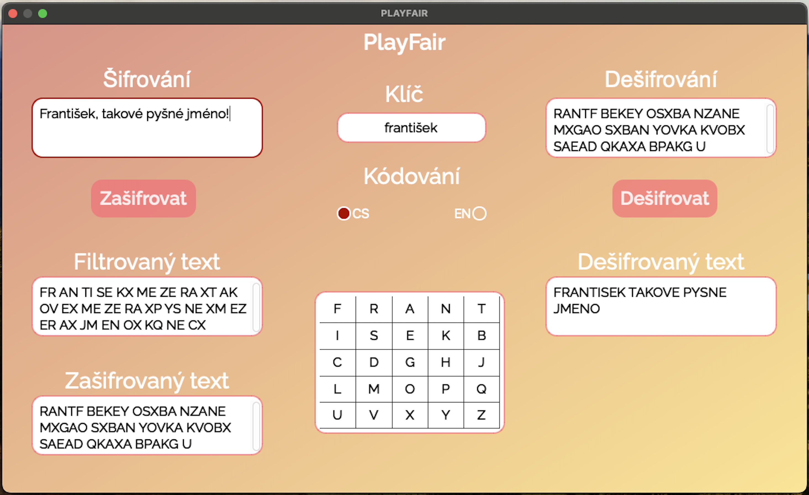

# PlayFairCypher

PlayFairCypher is a Python application that implements the Playfair cipher encryption and decryption algorithm. It includes a graphical user interface (GUI) built with PyQt6.

## 🎮 Features

- Encrypts and decrypts text using the Playfair cipher.
- Supports both Czech and English encoding.
- Handles diacritics and numbers in the text.
- Provides a user-friendly GUI for easy interaction.

## 🧠 GUI Overview

- **Šifrování**: Enter the text to be encrypted.
- **Klíč**: Enter the key for the Playfair cipher.
- **Zašifrovat**: Button to encrypt the text.
- **Dešifrování**: Enter the text to be decrypted.
- **Dešifrovat**: Button to decrypt the text.
- **Kódování**: Choose between Czech (CS) and English (EN) encoding.

## 📊 Example

### Encryption

1. Enter the text to be encrypted in the **Šifrování** field.
2. Enter the key in the **Klíč** field.
3. Click the **Zašifrovat** button.
4. The encrypted text will be displayed in the **Zašifrovaný text** field.

### Decryption

1. Enter the text to be decrypted in the **Dešifrování** field.
2. Enter the key in the **Klíč** field.
3. Click the **Dešifrovat** button.
4. The decrypted text will be displayed in the **Dešifrovaný text** field.

---

#### Author: Filip Hajduch
###### and GitHub Copilot